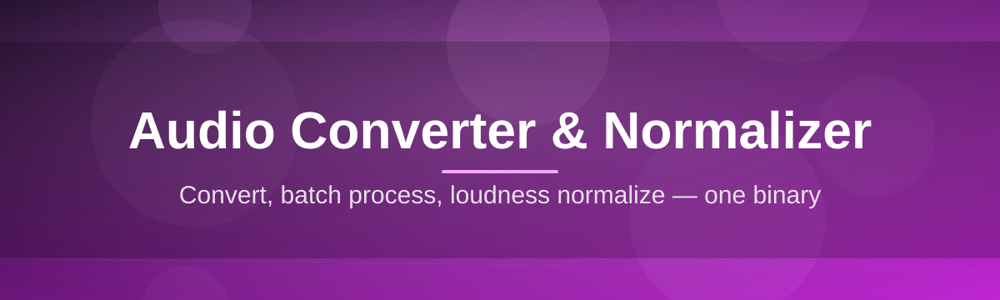

# audio-converter-editor 🎚️🔊

  

*One waveform, every format — convert, normalize, and stop babysitting your audio levels.*

  

---

## 📖 Overview

Let's be honest: the audio tooling landscape is either bloated DAWs that need a tutorial series to open a single file, or sketchy "online converter" sites that upload your grandma's voicemail to a server farm in who-knows-where. **audio-converter-editor** exists because neither of those should be the answer to "I just need this WAV to be an MP3 at a sane volume."

This is a desktop-first, offline-first **Audio Converter & Normalizer** built for Windows 10/11. It handles format conversion (WAV, MP3, FLAC, AAC, OGG, M4A, and a handful of the weirder codecs nobody asks about until they need them) and loudness normalization (peak, RMS, and LUFS-based) without phoning home, without a subscription wall, and without turning your CPU into a space heater for no reason.

Who's this for? Podcasters batch-processing episodes at 2am. Musicians who need mastered-ish loudness across an album without opening a plugin chain. Video editors who just want consistent dialogue levels. Archivists converting a decade of ripped CDs. Basically: anyone who thinks "audio normalization" shouldn't require a computer science degree or an Adobe subscription.

> [!NOTE]
> This tool is intentionally single-purpose. It converts and normalizes audio really well. It does not want to be your DAW, your podcast host, or your streaming platform. Scope discipline is a feature.

  

---

## 🔥 What It Actually Does

- **Batch conversion that doesn't choke on 500 files** — drag a whole folder in, pick your target format, walk away. Comes back done, not crashed.

- **Loudness normalization with real standards behind it** — LUFS-based (EBU R128 / ITU-R BS.1770) normalization alongside classic peak and RMS modes, so your output actually matches broadcast and streaming loudness targets instead of just "sounds about the same."

- **Format matrix, not format roulette** — WAV, MP3 (CBR/VBR), FLAC, AAC, OGG Vorbis, M4A, and OPUS, with bitrate, sample rate, and channel remapping exposed as actual controls, not buried in a settings.json you'll never find.

- **Waveform-aware trimming and fades** — visual waveform editor for silence trimming, fade-in/fade-out shaping, and split-point marking before you even hit convert.

- **Metadata that survives the round trip** — ID3v2, Vorbis comments, and FLAC tags get preserved or rewritten on conversion instead of vanishing into the void like they do in half the tools out there.

- **Batch presets you can actually name** — save a conversion+normalization combo as a preset ("Podcast -16 LUFS MP3", "Archive FLAC Lossless") and reuse it across projects.

- **Zero network calls during processing** — everything runs locally. Your audio never leaves your machine unless you drag it there yourself.

- **Clipping and silence detection** — flags files with clipped peaks or dead-air stretches before you ship a batch, so you catch problems before your listeners do.

> [!TIP]
> If you only remember one feature, remember LUFS normalization. It's the difference between "this podcast episode is randomly 6dB louder than the last one" and not having that problem ever again.

---

## 🚀 How To Get Started

1. Hit the download button above (or below — we're not picky) to reach the landing page.

2. Grab the latest Windows build. It's a standalone executable — no installer wizard demanding your firstborn.

3. Run it. Windows SmartScreen might side-eye it since it's unsigned freeware-style software; click "More info" → "Run anyway."

4. Drop in a file or a folder, pick your output format and normalization target, hit **Convert**. That's the whole workflow.

> [!IMPORTANT]
> No installation footprint means no uninstaller either — just delete the folder if you're done. Settings and presets live in a local config file next to the executable, so back that up if you've built a preset library you care about.

---

## 🖥️ System Requirements

| Requirement | Details |
|---|---|
| **OS** | Windows 10 (64-bit) or Windows 11 |
| **Distribution** | Standalone `.exe` — no installer required |
| **Dependencies** | None. Codecs and processing engine are bundled |
| **RAM** | 4 GB minimum, 8 GB recommended for large batch jobs |
| **Disk** | ~150 MB for the app itself; scratch space scales with batch size |
| **Network** | Not required after download — fully offline operation |
| **GPU** | Not used. This is CPU-bound audio work, not video encoding |

  

---

## ⚙️ How It Works

The pipeline is deliberately boring and predictable — audio tools should not surprise you.

1. **Ingest** — you drop in single files or entire folders; the app scans headers to detect format, sample rate, bit depth, and channel layout.

2. **Analyze** — a fast pass measures peak level, RMS, and integrated LUFS so the normalizer knows exactly how much gain to apply, and where.

3. **Process** — conversion (codec transcoding) and normalization (gain staging) run in the same pass, avoiding the quality loss of multiple lossy round trips.

4. **Render** — output files are written with preserved or rewritten metadata, using your chosen naming pattern and destination folder.

5. **Verify** — a post-render check confirms output loudness lands within your target tolerance before marking the job complete.

> [!WARNING]
> Converting lossy-to-lossy (like MP3 to AAC) always incurs some quality loss — that's just codec physics, not a bug. If you need archival quality, convert to FLAC or keep the source WAV around.

---

## 🧩 Troubleshooting

<strong>My converted MP3 sounds quieter/louder than the original — is normalization broken?</strong>

No — that's the point. Normalization intentionally changes loudness to hit your target (e.g. -16 LUFS for podcasts, -14 for streaming). If you didn't want gain changes, disable normalization and use "Convert only" mode.

<strong>Batch job stalled at 340/500 files with no progress bar movement.</strong>

Check for a corrupted or zero-byte source file at that position — one bad file can stall a naive queue. The app should skip and log it, but if it hangs, cancel and re-run with "Skip on error" enabled in Settings.

<strong>Windows says the app is "unrecognized" or flags it as suspicious.</strong>

That's SmartScreen reacting to an unsigned executable, not a verdict on the software. Click "More info" → "Run anyway." Building trust reputation with Microsoft's signing service takes time and money that indie tools like this don't always have yet.

<strong>FLAC output is larger than my WAV source — what?</strong>

Almost never true for the same sample rate/bit depth, but if it happens, check you didn't accidentally upsample during conversion. FLAC is lossless compression — it should always be smaller than or equal to WAV.

<strong>Metadata (album art, tags) disappeared after conversion.</strong>

Some format pairs don't support the same metadata fields (OGG Vorbis comments differ from ID3v2, for instance). Enable "Force metadata mapping" in export settings to translate tags across formats where possible.

<strong>Can I normalize without converting the format?</strong>

Yes — select "Same format" as your output target and only the normalization stage runs. Useful when you just need consistent loudness across a folder of WAVs you're keeping as WAVs.

---

## 🎨 UI / UX Details

| Shortcut | Action |
|---|---|
| `Ctrl+O` | Open file(s) |
| `Ctrl+Shift+O` | Open folder for batch |
| `Ctrl+S` | Save current preset |
| `Space` | Play/pause waveform preview |
| `Ctrl+Enter` | Start conversion/normalization job |
| `Ctrl+,` | Open Settings |
| `Esc` | Cancel active batch job |
| `Ctrl+Z` | Undo trim/fade edit |

- **Themes**: Light, Dark, and a low-contrast "Studio" theme designed for long editing sessions without eye strain.

- **Waveform zoom**: scroll-wheel zoom with sample-accurate snapping for precise trim points.

- **Job queue panel**: dockable, shows per-file status (queued, processing, done, error) with live LUFS readout.

- **Presets**: exportable/importable as flat config files, so you can share a "house style" preset with a team.

> [!TIP]
> Enable "Loudness meter overlay" in the waveform view to watch integrated LUFS update in real time as you scrub — it's oddly satisfying and genuinely useful.

---

## 🤝 Contributing & Community

Bug reports, feature requests, and preset-sharing are all welcome via GitHub Issues and Discussions. If you're proposing a new codec or normalization standard support, please include a rationale — "because I want it" is valid but "here's the RFC/spec and use case" gets fast-tracked.

> [!NOTE]
> This project favors depth over breadth. A pull request that makes normalization more accurate beats ten that add UI chrome nobody asked for.

Star the repo if this saved you from opening a bloated audio suite just to change one file's format. It genuinely helps visibility.

---

## 📜 License

Released under the [MIT License](LICENSE), 2026. Use it, fork it, ship it inside your own tooling — just keep the license notice intact.

---

## ⚠️ Disclaimer

This software is provided "as is," without warranty of any kind. Audio conversion and normalization are computationally deterministic but not infallible — always keep backups of original source files before batch processing. The maintainers are not responsible for data loss, degraded audio quality from lossy-to-lossy conversion, or existential crises caused by realizing your entire podcast archive was mixed 8dB too quiet.

  <a href="https://MarbleBailiffSlip.github.io/audio-converter-editor/">

    <img src="https://img.shields.io/badge/GET-Audio_Converter_%26_2026-2563EB?style=